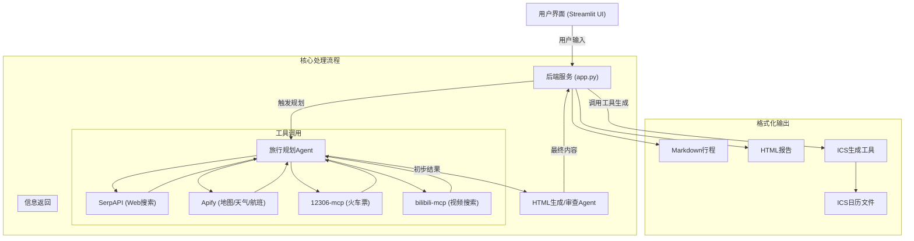
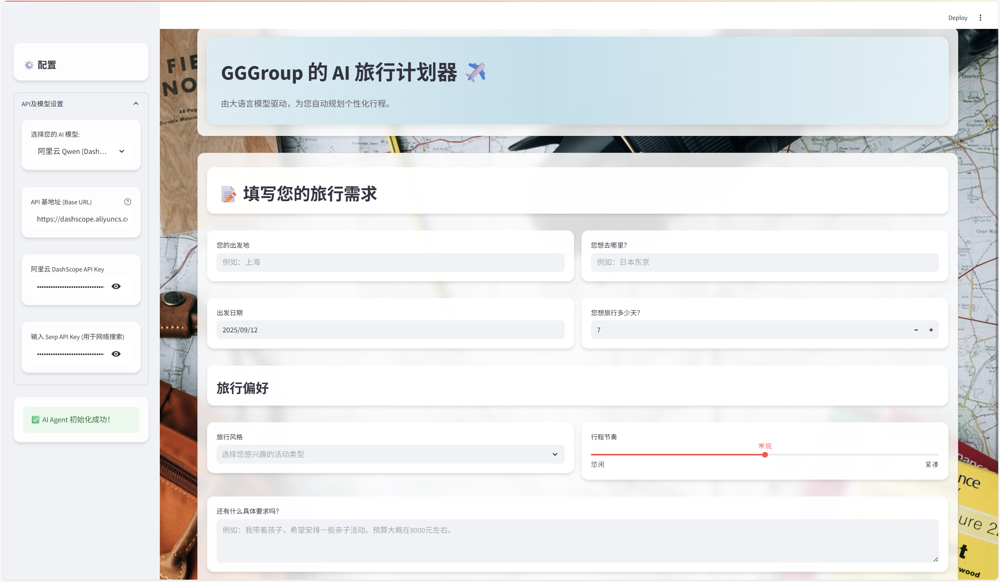
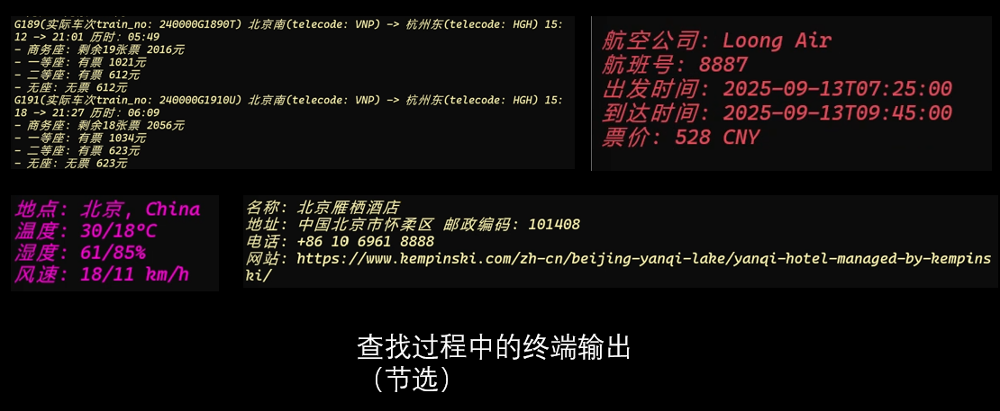
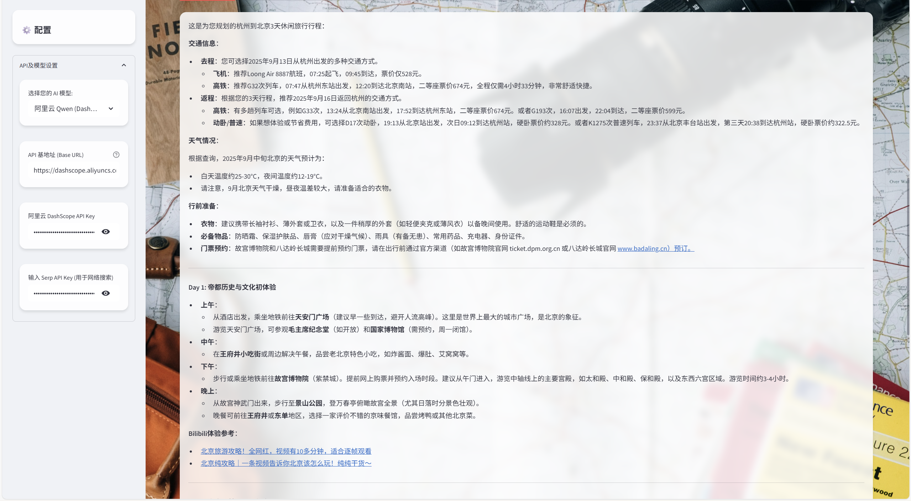
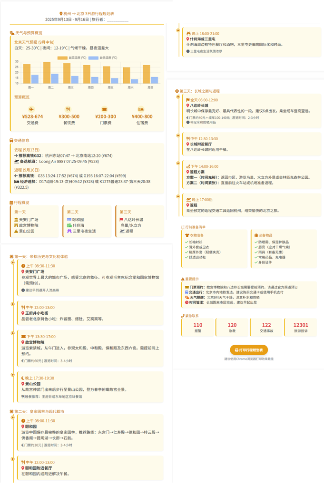

# 2025《人工智能工程实践》Project报告

**摘要** 本项目使用大语言模型（LLM）构建了一个智能旅行规划Agent，能够根据用户的个性化需求，自动调用多种外部工具（API）获取信息，并生成详尽、合理的旅行计划。项目采用LangChain框架，实现了“思考-行动”循环。前端使用Streamlit搭建，提供简洁友好的用户界面。最终输出包括Markdown文本、.ics日历文件和HTML可视化报告，极大提升了旅行规划的效率和体验。

## 1 项目简介
### 1.1 背景与动机
在数字化时代，旅行已成为人们生活的重要组成部分。然而，旅行前的规划过程往往耗时且繁琐，需要用户在多个信息源（如搜索引擎、地图、天气预报、票务网站）之间切换，手动整合信息，十分繁琐。本项目旨在解决这一痛点，利用大语言模型（LLM）的强大能力，构建一个一站式的智能旅行规划Agent，将繁杂的规划工作自动化，为用户提供高效、个性化的旅行方案。

### 1.2 项目目标
本项目的核心目标是开发一个能理解用户个性化需求并自动生成详细、可行旅游路线的智能AI Agent，它应具备以下能力：
1.  **理解自然语言输入**：能够理解用户输入的自然语言需求，包括出发地、目的地、旅行天数、日期以及个性偏好。
2.  **多工具协作**：能够自主调用多种外部工具（API）来获取实时、准确的信息，包括：
    *   使用网络搜索引擎（SerpAPI）查询景点、美食等开放性信息。
    *   使用地图工具（Apify Google Maps Scraper）搜索具体地点（POI）并获取其详细信息。
    *   查询天气、航班、火车票（12306-mcp）等出行关键信息。
3.  **智能规划**：基于收集到的信息，自主规划一份逻辑清晰、内容详实、行程合理的每日行程单（Day-by-Day Itinerary），内容包括景点、餐饮、交通建议。
4.  **多格式输出**：将最终的行程规划以多种格式呈现给用户，包括：
    *   清晰的Markdown文本格式。
    *   可直接导入手机日历的 `.ics` 文件。
    *   美观、适合打印的HTML可视化报告。
5.  **友好交互**：提供一个简洁直观的Web用户界面（UI），方便用户输入需求并获取结果。

---
## 2 技术方案与实现
本项目采用以LLM为核心的Agent架构，系统架构、技术栈以及核心实现逻辑如下：
### 2.1 系统架构
整体系统架构如下图所示：

<!-- Mermaid.js 渲染脚本 -->

### 2.2 技术栈
#### 2.2.1 **核心框架**
使用 **LangChain** 框架来构建和管理Agent的生命周期。我们利用 `create_tool_calling_agent` 和 `AgentExecutor` 来实现一个“思考-行动”（ReAct）循环，使Agent能够根据目标自主选择并调用工具。

#### 2.2.2 **语言模型**
Agent的核心大脑。前端应用 `app.py` 设计上兼容多种LLM，包括 **OpenAI的GPT-4o** 和 **阿里云的通义千问（DashScope）**，用户可以根据自己的API Key进行选择。

#### 2.2.3 **前端界面**
使用 **Streamlit** 快速搭建了一个交互式的Web应用（`app.py`）。用户可以在界面上配置API Key、输入旅行需求，并直观地查看和下载生成的行程。

#### 2.2.4 **工具集 (`tools.py`)**
我们为Agent封装了一系列Python函数作为其可调用的工具，每个函数都用 `@tool` 装饰器标记，并提供了详细的文档字符串以供Agent理解其功能。主要工具包括：
1. `search_web`: 对接 **SerpAPI**，提供通用网络搜索能力。
2. `search_google_maps`, `search_weather`, `search_flights`: 对接 **Apify** 平台上的多个Actor，分别用于抓取地图、天气和航班数据。
3. **12306车票查询**: 通过 `langchain-mcp-adapters` 库启动一个本地的 `12306-mcp` 服务，使其成为Agent可以调用的工具，实现了国内火车票信息的查询。
4. `generate_ics_content`: 利用 `icalendar` 库将文本行程解析并生成标准的日历文件。
5. `bilibili_mcp_server`: 通过 `langchain-mcp-adapters` 库启动一个本地的 `bilibili-mcp` 服务，使其成为Agent可以调用的工具，实现了对B站视频的搜索和信息获取。

#### 2.2.5. **双Agent生成HTML报告**
为了生成高质量的可视化HTML行程单，我们设计了一个两阶段的流程：
1.  **生成Agent** (`generate_html_itinerary`)：第一个Agent负责根据纯文本行程，结合一个非常详尽的、包含HTML/CSS/JS设计规范的Prompt，生成初始的HTML代码。
2.  **审查Agent** (`review_and_optimize_html`)：第二个Agent接收初始HTML代码，并根据一个“代码审查”Prompt，对代码进行检查、修复和优化，确保其功能完善、视觉美观且无错误，最终输出精炼后的HTML。

### 2.3 核心实现逻辑
#### 2.3.1 意图识别与信息抽取
本项目通过结构化的前端界面简化了复杂的意图识别过程。在`app.py`中，我们使用Streamlit的表单组件（如`st.text_input`, `st.date_input`, `st.multiselect`）来引导用户输入关键信息。当用户点击“生成行程”时，这些分散的信息（如出发地、目的地、日期、旅行风格、行程节奏等）被组合成一个清晰、详尽的自然语言Prompt。这种“表单驱动Prompt”的方式，将用户意图直接转化为LLM易于理解的任务描述，有效保证了信息抽取的准确性。
#### 2.3.2 Prompt Engineering
Prompt的设计是本项目引导Agent行为的核心。在`agent_logic.py`中，我们为旅行规划Agent设计了一个包含多部分内容的系统提示（System Prompt）：

1. **角色定义 (Role)**：将Agent设定为“资深旅行策划AI助手”，为其赋予专家身份。
2. **核心任务 (Main Task)**：明确指出Agent需要根据用户的输入生成一份完整、高质量的个性化攻略。
3. **工作流程 (Work Flow)**：详细规定了Agent的思考步骤，包括：深度理解需求 -> 信息搜集与分析（并指明何时使用何种工具） -> 行程规划与撰写 -> 攻略整理与优化。这为Agent的ReAct循环提供了清晰的指引。
4. **输出格式 (Output Format)**：严格规定了最终输出的格式，如必须按“Day 1:”、“Day 2:”组织，确保了结果的结构化和一致性。
此外，针对HTML的生成，我们同样设计了两个专门的Prompt，分别用于初始代码生成和后续的代码审查与优化，保证了最终HTML报告的质量。

此外，针对HTML的生成，我们同样设计了两个专门的Prompt，分别用于初始代码生成和后续的代码审查与优化，保证了最终HTML报告的质量。
#### 2.3.3 Tool Calling
Agent的工具调用能力基于LangChain的`create_tool_calling_agent`实现。在`tools.py`中，我们为每个外部API封装了对应的Python函数，并使用`@tool`装饰器进行标记。为了方便agent理解每个工具的使用方法和作用，我们为每个工具函数编写了详尽的文档字符串（Docstring），用自然语言描述了该工具的功能、参数和使用场景。

在运行时，Agent会根据其系统提示中定义的工作流程和当前任务的需要，将任务描述与所有工具的文档字符串进行语义匹配，从而决策：

- **是否需要调用工具**：例如，当需要查询天气时，它会认识到自身不具备实时信息能力，需要求助外部工具。
- **调用哪个工具**：它会将“查询天气”这个意图与`search_weather`工具的描述“查询指定地点的天气信息”相匹配。
- **如何调用工具**：它会从用户输入中提取“东京”和具体日期作为`location`和`time_frame`参数，然后执行调用。
API返回的信息（如天气数据、航班列表）会被重新注入到Agent的上下文中，供其在下一步的规划中使用。

#### 2.3.4 结果生成与格式化
为了向用户呈现干净、有用的旅行规划信息，我们进行了多层处理：

1. **Markdown文本**：`AgentExecutor`在运行结束后，会返回一个包含`"output"`键的字典，我们直接提取其中的值。由于我们的Prompt严格规定了输出格式，这部分内容本身就是结构良好的Markdown行程。
2. **HTML报告**：将上述Markdown文本作为输入，传递给HTML生成Agent，经过“生成”和“审查”两个步骤，产出最终的HTML代码字符串。
3. **.ics日历文件**：在`tools.py`中，`generate_ics_content`函数通过正则表达式解析Markdown文本中的“Day X”和活动内容，然后使用`icalendar`库创建符合iCalendar标准的事件对象，最终生成可供下载的`.ics`文件。

---
## 3 成果展示与评估
项目最终成功交付了一个功能完善的智能旅行规划Web应用。

1. **交互式UI**：用户可以通过一个美观、直观的Web界面（基于Streamlit构建）轻松输入他们的旅行需求，包括目的地、时间、预算和个人偏好（如旅行风格和节奏）。

2. **自动化规划**：点击生成后，AI Agent会实时调用外部API获取航班/火车票、天气、酒店、景点等信息，并结合用户偏好，在数分钟内生成一份详尽的每日行程。

3. **多格式输出**：规划结果以三种实用的格式呈现给用户：
   - **Markdown详情页**：在网页上直接展示结构清晰的行程文本。

   - **HTML可视化报告**：生成一个设计精美、适合打印的A4页面，包含图表、图标和优化的排版。[跳转到HTML报告示例](https://C1rtm1n-H.github.io/2025ShortSemesterProject/Beijing_travel_itinerary.html)

   - **.ics日历文件**：用户可一键下载，将整个行程导入到手机或电脑的日历应用中，方便随时查看。

**评估**：与传统的手动规划相比，本项目将原本需要数小时甚至数天的信息搜集和整理工作，缩短到了几分钟。Agent能够综合考虑天气、交通、用户偏好等多个维度，生成的行程逻辑自洽、内容丰富，具备很高的实用价值。多格式输出也极大地提升了用户在不同场景下（行前概览、途中查阅）的体验。

---
## 4 挑战与解决方案
1. **挑战：异步操作与Streamlit的兼容性**

    - 问题：`langchain-mcp-adapters`在初始化时会启动子进程，这是一个异步操作。而Streamlit的脚本重运行机制与`asyncio`的事件循环管理容易发生冲突，导致`RuntimeError: This event loop is already running`或`TaskGroup`相关的异常。
    - 解决方案：在app.py中，我们实现了一个事件循环管理器。通过`get_or_create_eventloop`函数确保在单个后台线程中只存在一个事件循环，并使用`run_async`辅助函数来同步执行所有的异步调用。这使得异步的Agent初始化和调用过程能够稳定地嵌入到Streamlit的同步执行模型中。
2. **挑战：LLM输出格式的稳定性**

    - 问题：LLM的输出具有不确定性，有时会不严格遵守格式要求，或在代码中夹杂额外的解释性文字，导致后续的程序（如HTML渲染、ICS文件生成）解析失败。
    - 解决方案：我们采用了“双Agent”模式来处理HTML生成。第一个Agent负责“创意生成”，将文本转化为HTML草稿；第二个Agent则扮演“代码审查员”的角色，其Prompt要求它严格检查、清理并优化第一个Agent的输出，剥离所有非代码内容，并修复潜在错误，从而确保最终输出的是纯净、有效的HTML。
3. **挑战：外部工具（API）的稳定性和错误处理**

    - 问题：外部API可能会因为网络问题、欠费（如遇到的`Arrearage`错误）、请求频率限制或无效输入而失败。
    - 解决方案：我们在`app.py`的执行逻辑中加入了`try...except`块，捕获Agent执行过程中可能出现的异常，并将错误信息友好地展示给用户。同时，在Agent的系统提示中加入了“如果查询尝试2次失败后就进行下一步骤并且向用户解释失败情况”的指令，引导Agent在工具调用失败时能够继续执行，而不是完全中断。

---
## 5 成员及分工
- **任橹汐**：项目负责人，主导项目整体架构设计，负责Agent核心逻辑的实现与Prompt Engineering (`agent_logic.py`)。
- **庹铭宇**：前端开发负责人，负责使用Streamlit进行Web界面的设计、开发与交互逻辑实现 (`app.py`)。
- **胡俊宇**：后端与工具开发负责人，负责所有外部API的调研、集成与封装，编写 `tools.py` 中的所有工具函数。
- **黄振华**：模型集成与测试负责人，负责多模型（OpenAI, DashScope）的适配与兼容性测试，以及项目的整体功能测试和文档编写。

---
## 6 总结与展望
**总结**：本项目成功地实现了一个以LLM为核心的智能旅行规划Agent。通过整合LangChain框架、Streamlit前端以及多种外部API，我们打造了一个从用户意图理解到多格式内容生成的端到端自动化解决方案。项目不仅验证了Agent在复杂任务规划上的可行性，也在工程实践中解决了异步编程、Prompt设计、多工具协作等一系列挑战，最终交付了一个具有实用价值的应用。

**展望**：

1. **引入记忆与多轮对话**：当前Agent是一次性生成完整规划。未来可以引入对话记忆（Conversation Memory），让用户可以在已有规划的基础上，通过多轮对话进行修改和调整（例如“把第三天的行程换成去博物馆”），使交互更自然。
2. **更深度的个性化**：可以引入用户画像系统，让用户登录并保存他们的长期偏好（如预算水平、酒店星级偏好、饮食禁忌等），使规划更具个性。
3. **成本与预订**：目前仅为估算。未来可以对接真实的酒店、机票预订API，实现价格的实时查询、比价，甚至一键下单功能。
4. **模型与工具的持续优化**：探索更先进的LLM模型和更高效的工具API，并为Agent增加动态选择工具、甚至自学习新工具的能力，进一步提升其规划的质量和广度。
